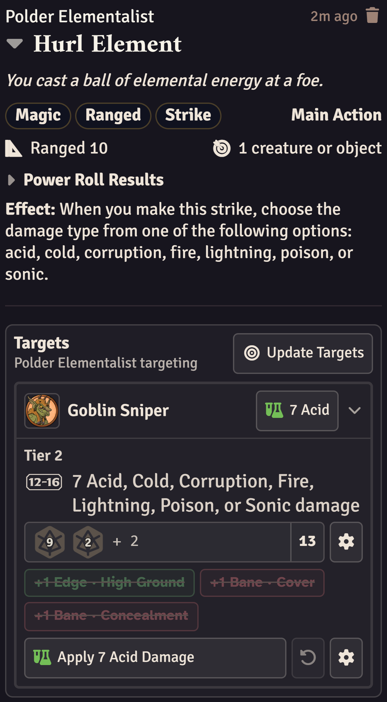
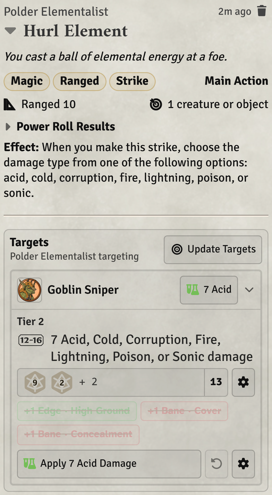
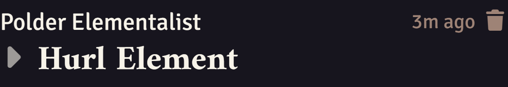
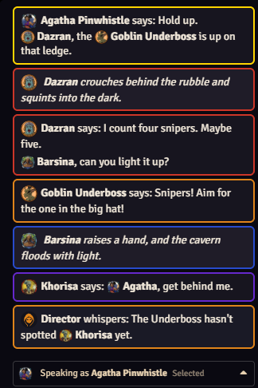
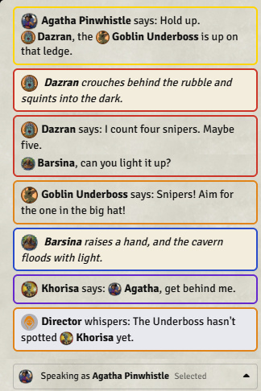
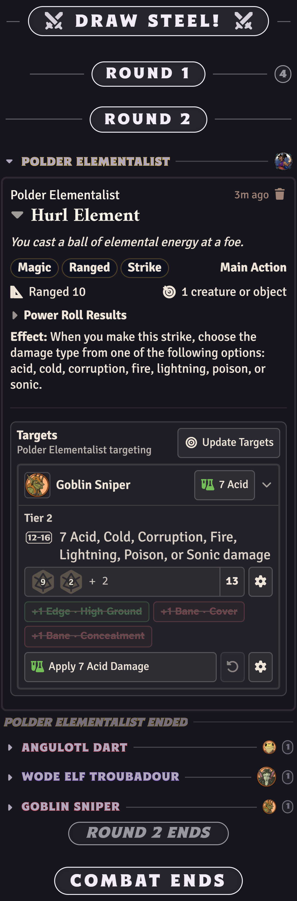

# Draw Steel: Battle Log

[](https://github.com/TheGenieOfTheCode/draw-steel-battle-log/releases)
[](https://github.com/TheGenieOfTheCode/draw-steel-battle-log/releases/latest)

*Keeping the logs orderly.*

A module for the Draw Steel system in Foundry VTT. It tidies the chat to be organized in battle and makes a few tweaks the look of abilities in the chat.

**Requires Foundry v14, the Draw Steel system, and [Draw Steel: CTLib](https://github.com/TheGenieOfTheCode/draw-steel-ctlib).**

---

[](https://ko-fi.com/genieofthecode)

*If you like what I do, consider donating on Ko-fi. Thanks!*

---

## Documentation

Full documentation is available on the **[Wiki](https://github.com/TheGenieOfTheCode/draw-steel-battle-log/wiki)**.

---

## Dark Theme 

The system's dark palette does not cover the chat, now interface includes the chat as well.

<div align="center">
  <table>
    <tr>
      <td></td>
      <td></td>
    </tr>
  </table>
</div>

## Compact Abilities

Click an ability's name and the card folds down to just that name, good for when you're done with an ability. The message format is also restructured so it fits the basic details in less space like in the books while preserving the default Draw Steel Foundry aesthetic.

<p align="center">
  
</p>


## Clean Comms

OOC or IC messages can fit on one line (as long as you're not playing a high elf with a canon name) and should overall take less space. They also carry a little portrait of the speaker, which is clickable if the speaker is a token. Finally, messages blend together if they're from the same speaker.

<div align="center">
  <table>
    <tr>
      <td></td>
      <td></td>
    </tr>
  </table>
</div>

## Turn Markers

Every turn gets a line across the chat log with the name and token of whoever is acting. Click it to ping that token. The name is drawn in the colour of the player running it. 

A turn marker folds away the messages during it once it ends, leaving one line and a count of how many messages are hidden. Rounds and whole fights fold the same way, so a long session collapses to a handful of lines. None of the markers can be collapsed while what they contain is still active (turn, round, combat).

<p align="center">
  
</p>


## Settings

Every feature can be turned off on its own, and each person chooses what they see. The one exception is the record of where the turns fell, which the Director keeps on everybody's behalf.

---

## Installation

Install via the Foundry module browser, or paste this manifest URL directly:

```
https://github.com/TheGenieOfTheCode/draw-steel-battle-log/releases/latest/download/module.json
```

Requires [Draw Steel: CTLib](https://github.com/TheGenieOfTheCode/draw-steel-ctlib), the shared library behind these modules. Foundry offers to install it alongside.

---

## Compatibility

- [Draw Steel: Target Damage](https://foundryvtt.com/packages/draw-steel-target-damage)
- [Draw Steel: Combat Tools](https://github.com/TheGenieOfTheCode/draw-steel-combat-tools)
- [Draw Steel Plus](https://github.com/featureJosh/draw-steel-plus) works with this module, but both restyle the same cards and making them work together cleanly isn't a priority.

---

## Issues & Feedback

Bug reports and feature requests go in [Issues](https://github.com/TheGenieOfTheCode/draw-steel-battle-log/issues).

